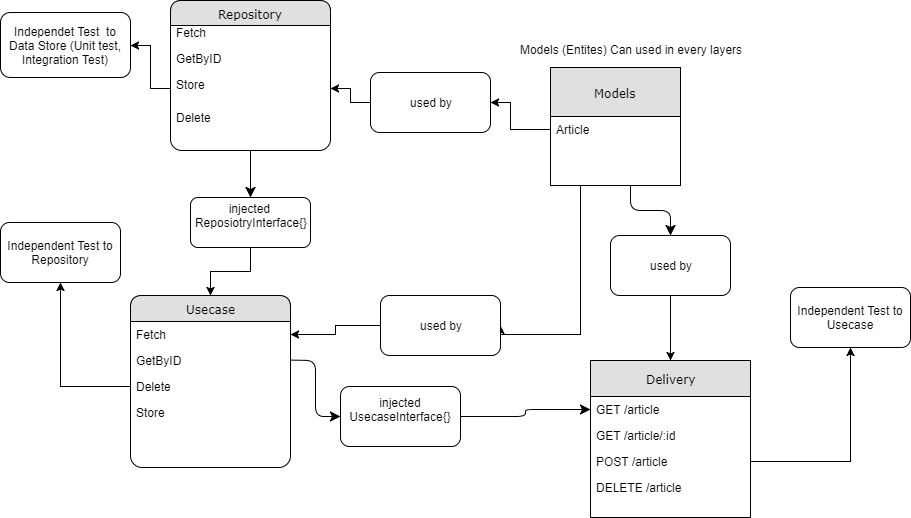

# ARCHITECTURE

## References

- <https://hackernoon.com/golang-clean-archithecture-efd6d7c43047>
- <https://github.com/bxcodec/go-clean-arch>.
- <https://manakuro.medium.com/clean-architecture-with-go-bce409427d31>
- <https://github.com/manakuro/golang-clean-architecture>

## Models

Entities that this app talk about.

## Repository

Act like a "CRUD" without business actions or rules.

## Usecase

Business layer. Accept inputs from **Delivery** layer. This layer will depends to **Repository** Layer.

## Delivery

The view layer. Acts like the familiar "cmd" layer, decide how the data will presented.
Here will be responsible for receiving user inputs too.
This will call **Usecase** layer, so it will depend on it.

## Frameworks and Drivers

Databases, frameworks, routers...

## Draw for me?

> [_"Moisés não consegue"_](https://www.instagram.com/p/CRhJ-5fjBBi/) - [@Jesse Alves](https://www.instagram.com/jesse.alves/)

