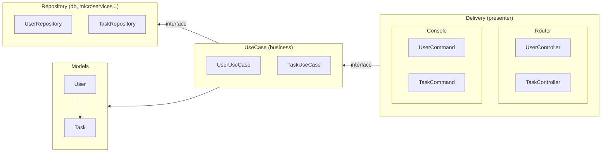
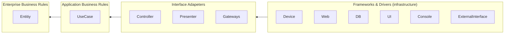
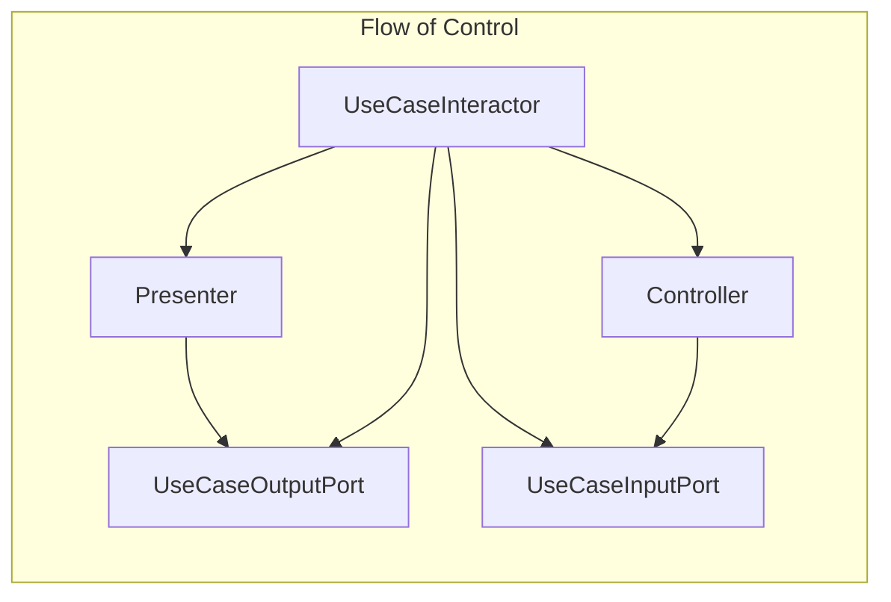

# Mermaid

<http://blog.8thlight.com/uncle-bob/2012/08/13/the-clean-architecture.html>

## By Iman Tumorang inspired by Bob’s Clean Architecture Concept

* <https://hackernoon.com/golang-clean-archithecture-efd6d7c43047>
* <https://hackernoon.com/trying-clean-architecture-on-golang-2-44d615bf8fdf>
* <https://github.com/bxcodec/go-clean-arch>

If Uncle Bob’s Architecture, has 4 layer :

* Entities
* Usecase
* Controller
* Framework & Driver

In my projects, I’m using 4 too :

* Models
* Repository
* Usecase
* Delivery

---

## By Ruangyot Nanchiang

* <https://orenrose.medium.com/clean-architecture-in-golang-with-go-kit-e5b716a3b881>
* <https://blog.cleancoder.com/uncle-bob/2012/08/13/the-clean-architecture.html>

