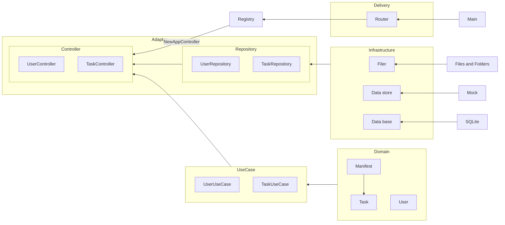

# Mermaid

```mermaid
flowchart RL;
    %%Infrastructure-->Registry
    %%DataBaseInfra--GetState-->TaskRepository
    %%DataStoreInfra-->UserRepository
    %%FilerInfra--GetManifest-->TaskRepository
    FilesAndFolders[Files and Folders]-->FilerInfra
    Main-->Router
    Mock-->DataStoreInfra
    Router-->Registry
    Registry--NewAppController-->Controller
    SQLite-->DataBaseInfra
    %%TaskRepository-->TaskController
    Repository-->Controller
    %%TaskUseCase-->TaskController
    %%UserRepository--NewTaskUsecase-->UserController
    %%UserUseCase--NewUserUsecase-->UserController
    UseCase-->Controller
    Domain-->UseCase
    Infrastructure-->Repository

    subgraph Controller
    UserController
    TaskController
    end

    subgraph Delivery
    Router
    end

    subgraph UseCase
    UserUseCase
    TaskUseCase
    end

    subgraph Infrastructure
    DataStoreInfra[Data store]
    DataBaseInfra[Data base]
    FilerInfra[Filer]
    end

    subgraph Repository
    UserRepository
    TaskRepository
    end

    subgraph Adapter
    Repository
    Controller
    end

    subgraph Domain
    Task
    Manifest
    User
    Manifest-->Task
    end
```
