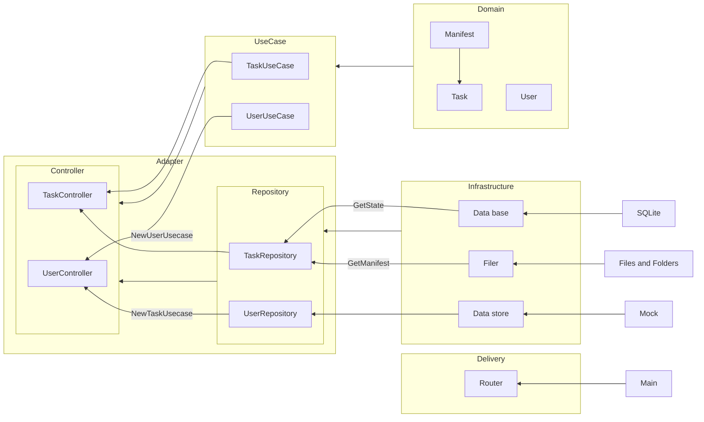

# Mermaid

```mermaid
flowchart RL;
    DataBaseInfra--GetState-->TaskRepository
    DataStoreInfra-->UserRepository
    Domain-->UseCase
    FilerInfra--GetManifest-->TaskRepository
    FilesAndFolders[Files and Folders]-->FilerInfra
    Infrastructure-->Repository
    Main-->Router
    Mock-->DataStoreInfra
    Repository-->Controller
    SQLite-->DataBaseInfra
    TaskRepository-->TaskController
    TaskUseCase-->TaskController
    UseCase-->Controller
    UserRepository--NewTaskUsecase-->UserController
    UserUseCase--NewUserUsecase-->UserController

    subgraph Controller
    UserController
    TaskController
    end

    subgraph Delivery
    Router
    end

    subgraph UseCase
    UserUseCase
    TaskUseCase
    end

    subgraph Infrastructure
    DataStoreInfra[Data store]
    DataBaseInfra[Data base]
    FilerInfra[Filer]
    end

    subgraph Repository
    UserRepository
    TaskRepository
    end

    subgraph Adapter
    Repository
    Controller
    end

    subgraph Domain
    Task
    Manifest
    User
    Manifest-->Task
    end
```
